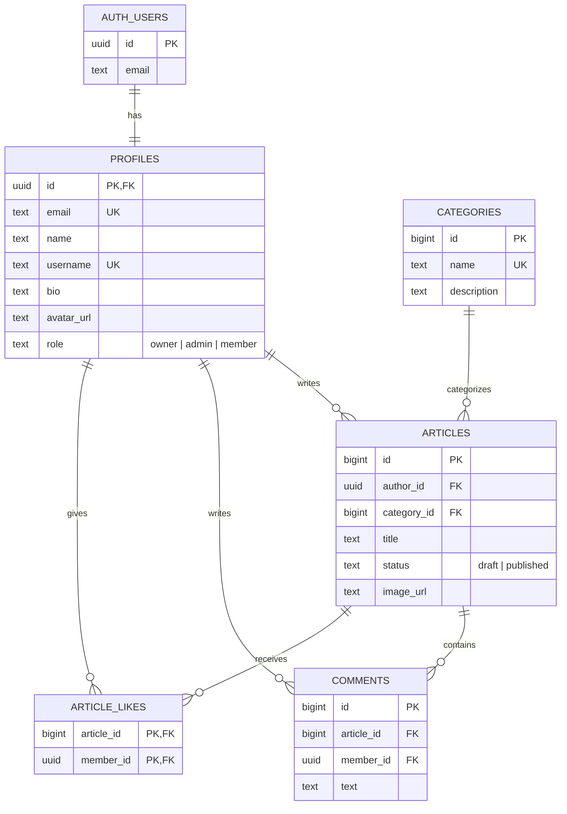

# Oak Blogspot ERD

`owner` and `admin` can create, update, and delete articles. Only `owner` can
update the website-owner profile. `member` can comment and like articles.
Authorization is enforced by the Express middleware; database foreign keys
enforce entity relationships.
